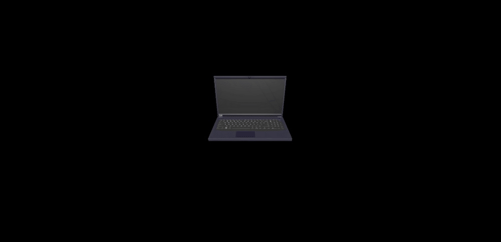

# threejs-sample  
This is a 3D model of a laptop created on blender with animations done using three.js!

## Testing
To view this laptop sample, please clone the repo and run the command 'npx serve .' in the terminal. You may then go to http://localhost:3000/ to view the sample.

## Usage
Press any key to render the zoom function. Once the zoom function is completed, the laptop will continuously rotate.  
  

